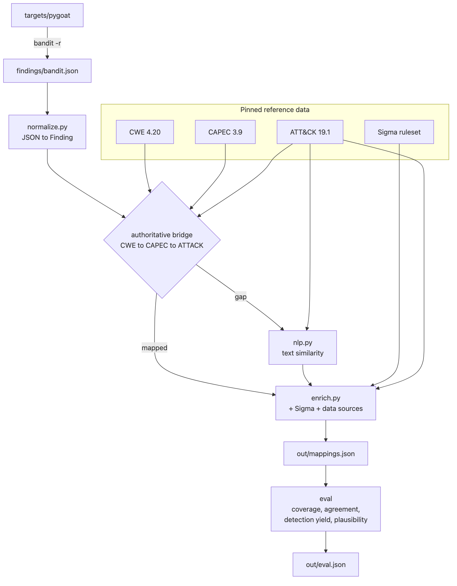
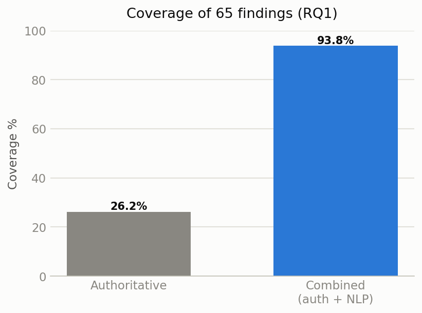

# SAST → ATT&CK Mapping Pipeline

Maps confirmed SAST findings to MITRE ATT&CK techniques via the
**CWE → CAPEC → ATT&CK** chain, with an NLP text-similarity fallback for gaps and
SOC detection enrichment (Sigma rules + ATT&CK data sources). MSc dissertation
artefact — reproducible and fully traceable.



## Requirements

- Python 3.11+ (developed on 3.13)
- `git` (to fetch the Sigma ruleset and the target app)

## Install

```
pip install -r requirements.txt
pip install e . --no-deps
```

## Data setup (once)

Downloads the pinned catalogues and clones the ruleset + target app. Exact
versions are pinned in `data/VERSIONS.txt` — never refresh mid-experiment.

```
python -m pipeline.data.refresh_cti          # CWE, CAPEC, ATT&CK -> data/
git clone https://github.com/SigmaHQ/sigma data/sigma
git -C data/sigma checkout 0e3b749e0d85cd943706ed610a1447f0d54e8388
git clone https://github.com/adeyosemanputra/pygoat targets/pygoat
```

## Run

```
# 1. Scan the target app -> findings JSON
bandit -r targets/pygoat -f json -o findings/bandit.json

# 2. Run the pipeline (authoritative only)
python -m pipeline.run --input findings/ --out out/

#    ... with NLP fallback and detection enrichment
python -m pipeline.run --input findings/ --out out/ --nlp --enrich

# 3. Evaluate (Table 2 metrics)
python -m eval.run --pred out/mappings.json          # coverage + detection yield
python -m eval.run --agreement --input findings/     # authoritative vs NLP (RQ2)
python -m eval.run --pred out/mappings.json --sample 20   # emit plausibility sheet
python -m eval.run --pred out/mappings.json --labels out/plausibility_labels.csv
```

## Test / lint / type-check

```
pytest -q
ruff check . && ruff format --check .
mypy pipeline eval
```

## Results (PyGoat, 65 findings)

| Metric | Result |
|---|---|
| Coverage (RQ1) | 26% authoritative → 94% with NLP |
| Method agreement (RQ2) | mean Jaccard 0.056 (complementary methods) |
| Detection yield (RQ3) | Sigma 81% · data source 96% |
| Plausibility (RQ1) | 15% strict / ~40% lenient (20 sampled) |



Reproducibility: same input + same `data/VERSIONS.txt` versions → identical
output (deterministic; no wall-clock or unseeded randomness in mapping).
